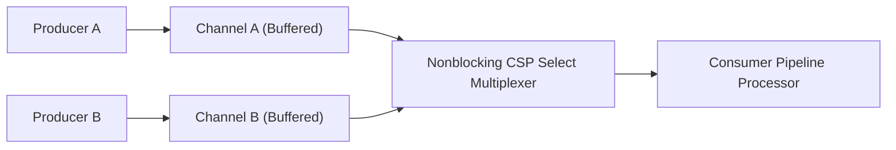

# genpark-csp-channel-multiplexing-pipeline-skill

Agent Skill implementing **Communicating Sequential Processes (CSP)** Go-style buffered/unbuffered channels with nonblocking `select` multiplexing.

## Architectural Overview

